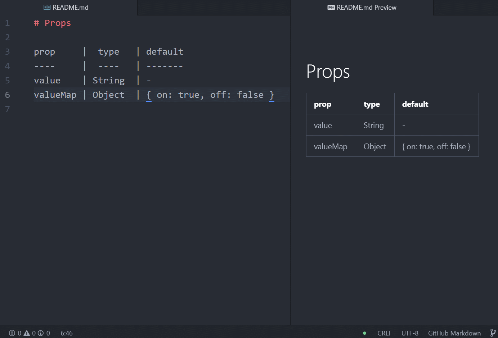

# Props

prop     |  type   | default
----     |  ----   | -------
value    | String  | -
valueMap | Object  | {<!--DONT-REMOVE:eyBvbjogdHJ1ZSwgb2ZmOiBmYWxzZSB9--> &nbsp;&nbsp;&nbsp;&nbsp;"on": true, &nbsp;&nbsp;&nbsp;&nbsp;"off": false }

